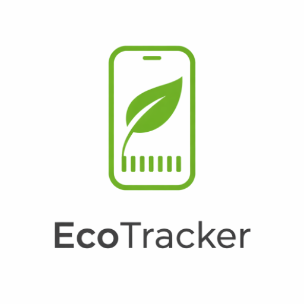
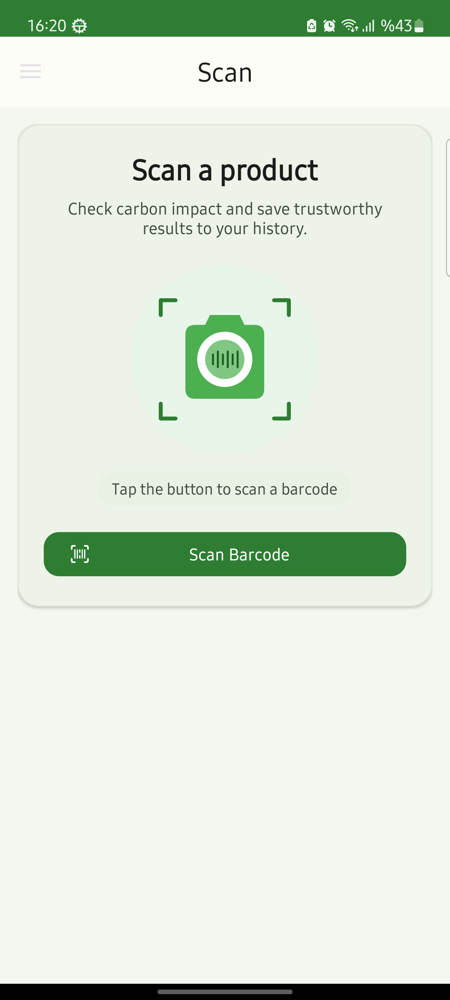
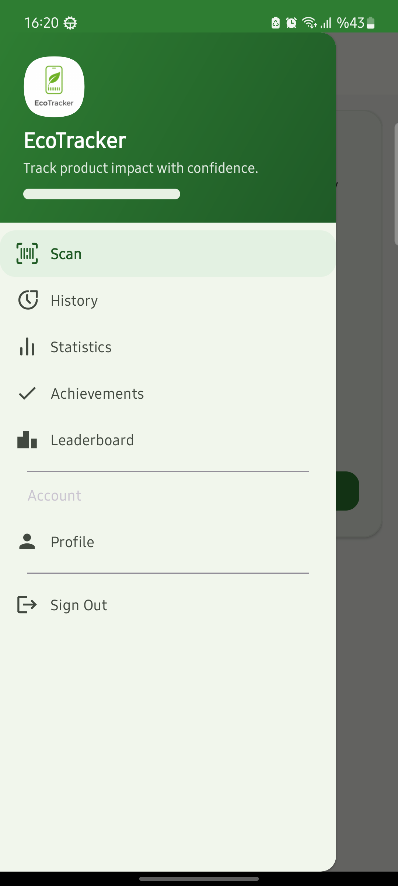
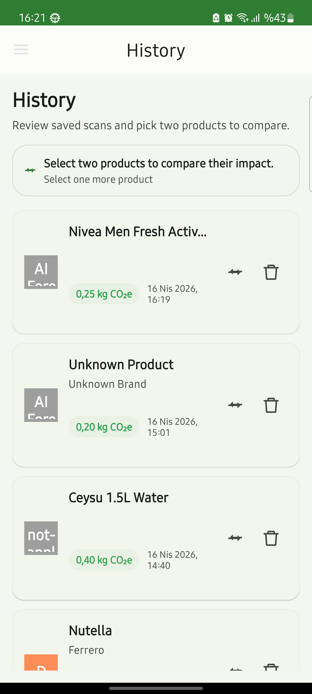
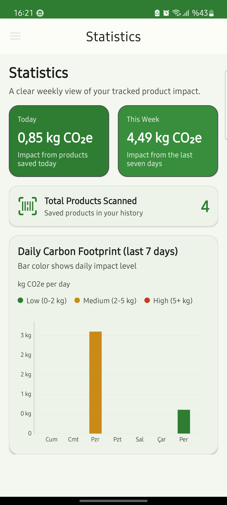
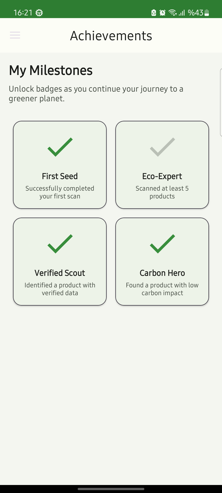
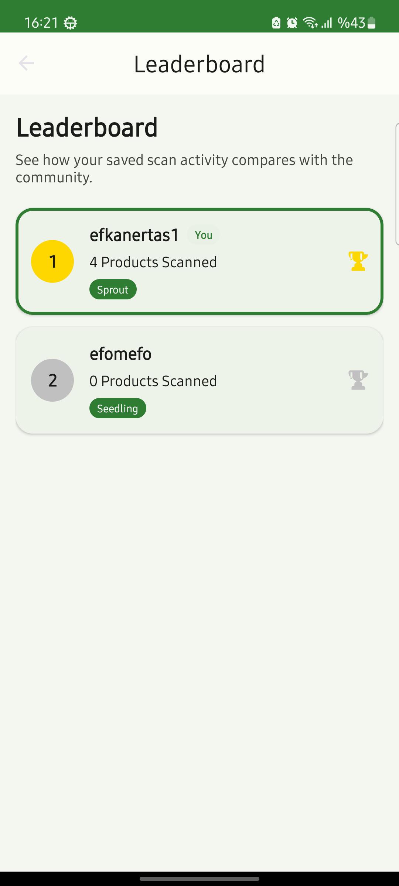
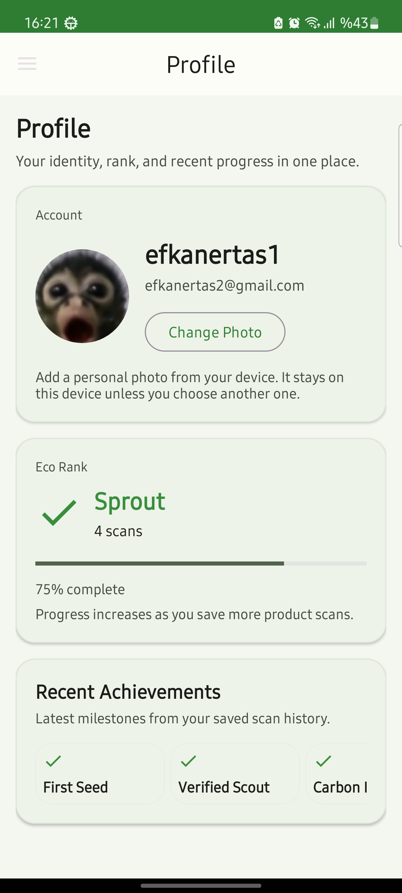
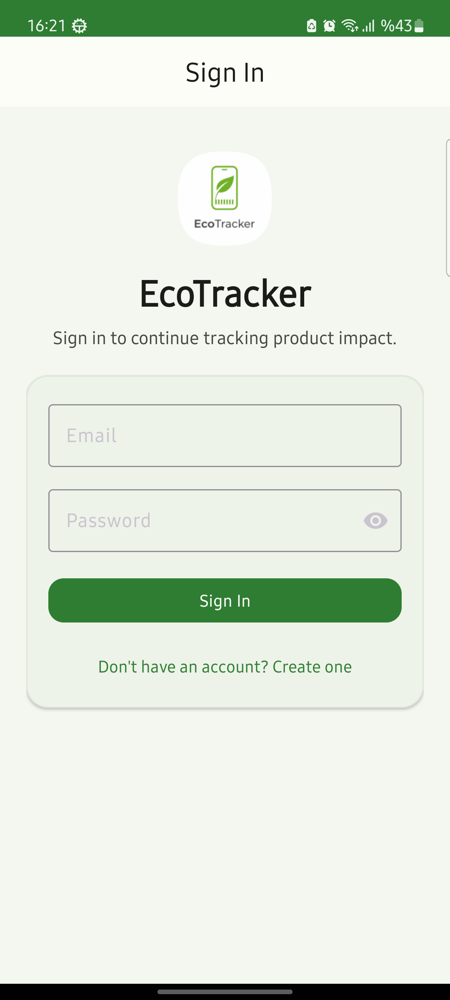
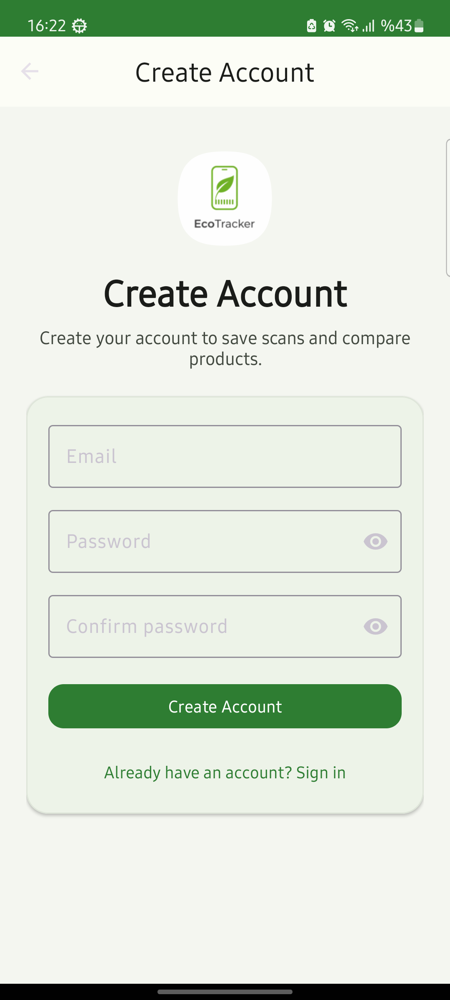

# EcoTracker

EcoTracker is an Android application for scanning product barcodes, estimating product carbon impact, and keeping a personal history of saved results. The project combines on-device persistence with public product data sources and Firebase-backed user features so users can scan, review, save, and revisit environmental impact data in a single flow.

It was built as a portfolio Android project focused on practical architecture, defensive fallbacks, and a complete user experience rather than a single isolated feature.



## Project Overview

EcoTracker starts with a barcode scan and tries to resolve a usable product result from multiple sources. When structured product data is available, the app uses it directly. When data is incomplete, it can fall back to cached results, secondary APIs, and optional AI-assisted estimation. Saved scans feed into local history, weekly statistics, profile progress, achievements, and a community leaderboard.

The app covers:

- product lookup
- fallback handling for incomplete data
- local persistence
- account-based features
- lightweight gamification
- analytics-style summaries for user history

## Key Features

- Barcode scanning with camera-based input
- Product lookup through Open Food Facts, Open Beauty Facts, Firestore cache, and UPCitemdb fallback
- Optional Gemini-assisted estimation when product data is incomplete
- Local Room-backed scan history and cached product storage
- Product comparison flow from saved history
- Daily and weekly carbon summary cards with chart visualization
- Firebase Authentication with email/password sign-in
- Firestore-backed leaderboard and shared remote product cache
- Profile screen with local avatar selection and progress tracking
- Achievement badges tied to scan milestones and product quality signals

## Tech Stack

- Kotlin
- XML layouts with ViewBinding
- MVVM-style presentation with repository-based data access
- Hilt for dependency injection
- Room for local persistence
- Retrofit and OkHttp for network access
- Kotlin Coroutines and Flow
- Firebase Authentication
- Firebase Firestore
- ZXing Android Embedded for barcode scanning
- MPAndroidChart for statistics visualization
- Glide for image loading

## Architecture Summary

The app follows a layered Android structure:

```text
UI (Activities / Fragments)
  -> ViewModels
    -> EcoTrackerRepository
      -> Room DAO
      -> Retrofit services
      -> Firebase Auth / Firestore
      -> Optional Gemini estimation
```

The repository is the main coordination point. It handles:

- multi-source barcode lookup
- fallback selection when a source is weak or missing
- local save behavior
- remote sync for authenticated users
- leaderboard and profile-related data loading

Room storage is intentionally split into two tables:

- `cached_products` keeps the latest known product data by barcode
- `scan_history` keeps per-scan user history entries

That separation avoids mixing cache state with user history and makes statistics, deletion, and migrations more reliable.

## Screenshots

| Scan | Navigation | History |
| --- | --- | --- |
|  |  |  |

| Statistics | Achievements | Leaderboard |
| --- | --- | --- |
|  |  |  |

| Profile | Sign In | Create Account |
| --- | --- | --- |
|  |  |  |

## How It Works

1. Scan a product barcode from the main scan screen.
2. Resolve product data through a fallback chain: local cache, public APIs, Firestore cache, then optional AI-assisted estimation.
3. Review the result and save it locally.
4. Use saved scans to build history, compare products, update profile progress, unlock achievements, and populate statistics.
5. If the user is signed in, sync aggregate user data and leaderboard-related information to Firestore.

## Data Resolution Flow

When a barcode is scanned, the repository attempts lookup in this order:

1. Local cached product
2. Open Food Facts
3. Open Beauty Facts
4. Shared Firestore product cache
5. UPCitemdb
6. Optional Gemini-assisted estimation
7. User hint input when automatic matching is still insufficient

The app prefers stronger matches first and falls back to weaker candidates only when needed.

## Testing and Quality Work

The project includes unit and instrumentation coverage for logic that is easy to regress:

- Unit tests for repository lookup behavior and save flow
- Unit tests for carbon calculation logic
- Unit tests for app configuration helpers
- Unit tests for gamification rules
- Instrumentation tests for Room DAO behavior
- Instrumentation tests for database migration behavior

Quality-focused implementation details:

- Barcode values are masked in logs
- Local save succeeds even if Firestore sync fails
- Cache entries use a defined TTL for remote reuse
- Lookup and sync paths handle API and network failures defensively
- History and cache were separated into dedicated persistence tables through migration work

## Engineering Decisions and Challenges Solved

### Multi-source lookup without blocking the product flow

Product data quality is inconsistent across public datasets. The repository uses parallel lookups and a best-candidate fallback strategy so the app can return something useful without pretending every result is equally trustworthy.

### Separating cached products from scan history

Earlier Android projects often store "last known product" and "user saved event" as one concept. This app treats them differently, which makes deletion, migrations, and statistics materially cleaner.

### Supporting offline-first local behavior with optional cloud features

Room is the primary source of truth for on-device history and statistics. Firebase adds authentication, leaderboard data, and shared cache support, but local use does not depend on constant cloud success.

### Handling incomplete product metadata

Not every product has reliable carbon data. The app uses estimation as an assistive fallback rather than presenting it as equivalent to verified structured data.

## Known Limitations

- Carbon impact quality depends on external product datasets and, for some results, estimation rather than verified lifecycle analysis.
- Firestore sync is partial; the app stores local history on-device and syncs selected user and leaderboard-related data for authenticated users.
- Some profile and achievement flows work end to end, but they are still good candidates for future architecture cleanup.
- The app currently targets email/password authentication only.
- API availability and response quality can vary because the project depends on public product data providers.

## Setup and Run

### Prerequisites

- Android Studio
- JDK 17
- Android SDK with API 24+ support

### 1. Clone the repository

```bash
git clone <repo-url>
cd EcoTracker
```

### 2. Configure local properties

Use `local.properties.example` as a reference for local setup.

Required local items:

- Android SDK path
- `GEMINI_API_KEY` only if you want AI-assisted estimation enabled

Example:

```properties
sdk.dir=C\:\\Users\\<you>\\AppData\\Local\\Android\\Sdk
GEMINI_API_KEY=your_key_here
```

### 3. Add Firebase configuration

Create a Firebase project with:

- Email/Password Authentication
- Cloud Firestore

Then place your `google-services.json` file at:

```text
app/google-services.json
```

### 4. Build or run

```bash
./gradlew assembleDebug
```

From Android Studio, you can also run the `app` configuration directly on an emulator or device.

### 5. Run tests

```bash
./gradlew test
```

For instrumentation coverage:

```bash
./gradlew connectedAndroidTest
```

## Future Improvements

- Add clearer source attribution in the result UI for verified vs estimated values
- Expand test coverage around Firestore-backed flows
- Improve profile and achievement feature boundaries to reduce UI/data coupling further
- Add richer product detail views for saved items
- Support more authentication providers if the project scope grows

## Repository Notes

- `local.properties` and `app/google-services.json` should remain local-only
- generated build output should not be committed
- screenshot assets used in this README live under `assets/screenshots`
